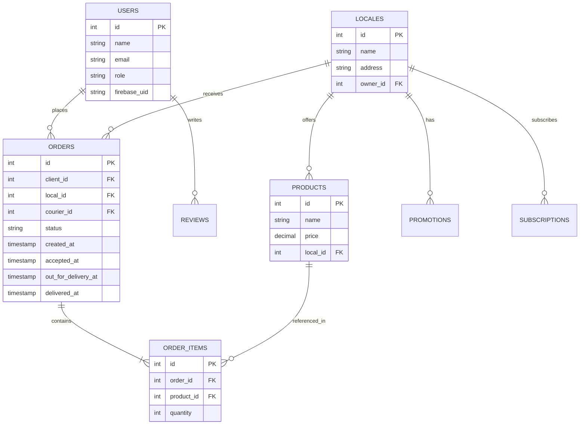

# Unidad II - Metodología y Aprendizaje Basado en Proyectos

**Proyecto:** AguaYa – Plataforma tipo Rappi para la entrega de agua potable (PWA + SaaS)

**Integrantes:**
- Juan German Rosas Rios
- Jose Alejandro Lopez Martinez

> Nota sobre contribución: Alejandro colaboró en parte del backend y en la integración/agregado de las APIs de Google; Juan realizó el resto del desarrollo (frontend, PWA, diseño, base de datos, documentación y coordinación del proyecto).

---

PORTADA

- Nombre de la Universidad: [Nombre de la Universidad]  
- Nombre de la Carrera: [Nombre de la Carrera]  
- Nombre de la asignatura: Metodología y Aprendizaje Basada en Proyectos  
- Nombre del proyecto: AguaYa – Plataforma tipo Rappi para la entrega de agua potable  
- Integrantes: Juan German Rosas Rios; Jose Alejandro Lopez Martinez  
- Profesor: [Nombre del Profesor]  
- Fecha de entrega: [Fecha]  

> (Rellenar los campos entre corchetes antes de generar PDF final)

---

1. Introducción

Español:

AguaYa es una plataforma web progresiva (PWA) diseñada para facilitar la entrega de agua potable en garrafones, orientada a pequeñas y medianas purificadoras que desean profesionalizar su servicio de reparto. Esta plataforma funciona como SaaS para que varias purificadoras compartan la misma infraestructura con cuentas y configuraciones independientes.

Inglés:

AguaYa is a Progressive Web App (PWA) designed to facilitate the delivery of bottled water, aimed at small and medium purification businesses that want to professionalize their delivery service. The platform is offered as a SaaS so multiple purification businesses can share the same infrastructure with separate accounts and configurations.

---

2. Misión, Visión, Política de Calidad

Misión:

Proveer una plataforma digital accesible y fácil de usar que permita a purificadoras gestionar ventas y entregas de agua potable de manera eficiente, transparente y segura, mejorando la experiencia del cliente y optimizando la operación logística.

Visión:

Ser la plataforma de referencia en entregas de agua potable para purificadoras locales en la región, contribuyendo a la digitalización y profesionalización del servicio.

Política de Calidad:

Nos comprometemos a desarrollar y mantener un software confiable y seguro, priorizando la satisfacción del cliente, la mejora continua y el cumplimiento de buenas prácticas de desarrollo y protección de datos.

---

3. Alcance y descripción del proyecto

Alcance:

- Desarrollo de una PWA con interfaces para cliente, repartidor, dueño de purificadora y administrador general.
- Implementación de autenticación (Firebase) y almacenamiento relacional de datos (PostgreSQL).
- Funcionalidades principales: catálogo y carrito, pedidos, estados de pedido, vista de mapa para repartidor, dashboard para dueños, sistema de suscripciones (SaaS) y soporte básico offline mediante service worker.

Fuera del alcance inicial:

- Aplicaciones nativas (Android/iOS) en la fase 1.
- Algoritmos avanzados de optimización de rutas (se planifican como mejora futura).
- Integraciones contables y pasarelas de pago en la fase 1.

Descripción breve:

El proyecto incluye frontend (React + Vite), backend (Node.js + Express), autenticación con Firebase y una base de datos PostgreSQL para almacenar pedidos, productos, usuarios y métricas. La aplicación será desplegada mediante HTTPS y contarán con manifest.json y service worker para comportamiento PWA.

---

4. Objetivo general

Desarrollar una Plataforma Web Progresiva (PWA) tipo SaaS que permita a purificadoras gestionar pedidos y entregas de agua potable de forma eficiente y escalable, mejorando la experiencia del cliente y la gestión operativa de las tiendas.

---

5. Objetivos específicos

- Implementar el flujo completo de pedido (catálogo → carrito → confirmación → asignación a repartidor → entrega).
- Desarrollar dashboards con métricas para dueños y administrador.
- Integrar autenticación segura mediante Firebase.
- Implementar manejo de estados y trazabilidad de pedidos con timestamps.
- Desplegar la PWA con manifest y service worker para soporte offline parcial.
- Documentar el proyecto y preparar entregables para la unidad.

---

6. Aspectos legales

- Protección de datos: Cumplir con buenas prácticas de manejo de datos personales (correo, teléfono, dirección) y evitar almacenamiento de información sensible sin encriptación. Utilizar HTTPS para transmisión segura.
- Licencias: Utilizar licencias compatibles con las dependencias (por ejemplo, MIT para código propio y respetar licencias de librerías de terceros).
- Uso de APIs externas: Las integraciones con APIs de Google (Maps / Geocoding) deben respetar los términos de uso y políticas de facturación de Google Cloud.

---

7. Fases del proyecto

1. Planificación y análisis (2 semanas)  
2. Diseño (2 semanas)  
3. Implementación / programación (6 semanas)  
4. Pruebas (2 semanas)  
5. Implementación piloto (1 semana)  
6. Ajustes y entrega final (1 semana)

---

8. Asignación de roles (*)

- Juan German Rosas Rios (Coordinador de proyecto / Frontend / PWA / UI/UX / Documentación / Base de datos):
  - Diseño de la interfaz, componentes React, service worker, manifest.
  - Esquema y modelos de datos en PostgreSQL.
  - Preparación de documentación y entregables.

- Jose Alejandro Lopez Martinez (Backend / Integración de APIs de Google / Endpoints / Seguridad):
  - Desarrollo de API en Node.js (Express).
  - Integración con Firebase y Google Maps APIs (geocoding, reverse geocoding, map embedding).
  - Lógica de asignación de pedidos y endpoints para métricas.

(*) Se destaca la contribución de cada integrante para efectos de evaluación.

---

9. Minutas (resumen de reuniones)

Reunión 1 - Inicio del proyecto
- Fecha: [16/07/2025]  
- Asistentes: Juan, Alejandro  
- Temas tratados: Definición del alcance, roles, herramientas y cronograma.  
- Acuerdos: Iniciar diseño de UI y esquema de BD; Alejandro prepara entorno backend y keys de Google Cloud.

Reunión 2 - Revisión de diseño y API
- Fecha: [23/07/2025]  
- Asistentes: Juan, Alejandro  
- Temas tratados: Progreso del frontend, endpoints básicos, validación de direcciones con Google Maps.  
- Acuerdos: Implementar validaciones en formulario de dirección y endpoint para geocoding.

Reunión 3 - Pruebas piloto
- Fecha: [30/07/2025]  
- Asistentes: Juan, Alejandro  
- Temas tratados: Resultados de pruebas internas, corrección de bugs críticos.  
- Acuerdos: Ajustes en manejo de timestamps y mejoras de UX en vista de repartidor.

(Incluir más minutas según avance y mantener registro en carpeta de proyecto)

---

10. Programación de actividades

| Actividad | Responsable | Fecha inicio | Fecha fin |
|-----------|-------------|--------------|-----------|
| Planificación y análisis | Juan y Alejandro | 16/07/2025 | 30/07/2025 |
| Diseño UI/UX | Juan | 24/07/2025 | 07/08/2025 |
| Desarrollo Backend | Alejandro | 24/07/2025 | 20/08/2025 |
| Desarrollo Frontend | Juan | 01/08/2025 | 20/08/2025 |
| Pruebas unitarias e integración | Juan y Alejandro | 21/08/2025 | 04/09/2025 |
| Implementación piloto | Juan y Alejandro | 05/09/2025 | 11/09/2025 |
| Entrega final y documentación | Juan | 12/09/2025 | 18/09/2025 |

---

11. Cronograma de actividades

(Se sugiere convertir esta tabla en un diagrama Gantt para la entrega final.)

| Semana | Actividades clave |
|--------|-------------------|
| Sem 1 (16/07) | Inicio y planificación |
| Sem 2 (23/07) | Diseño y preparación de ambiente |
| Sem 3 (30/07) | Inicio de desarrollo frontend/backend |
| Sem 4 (06/08) | Desarrollo continuo |
| Sem 5 (13/08) | Desarrollo y pruebas unitarias |
| Sem 6 (20/08) | Integración y pruebas de sistema |
| Sem 7 (27/08) | Correcciones y mejoras |
| Sem 8 (03/09) | Pruebas finales |
| Sem 9 (10/09) | Piloto y ajustes |
| Sem 10 (17/09) | Entrega final |

---

12. Modelo entidad-relación

A continuación se presenta un diagrama ER simplificado (Mermaid) y una explicación de las entidades principales.



---

13. Modelo relacional de la base de datos (esquema SQL básico)

```sql
-- Tabla de usuarios
CREATE TABLE users (
  id SERIAL PRIMARY KEY,
  name VARCHAR(150) NOT NULL,
  email VARCHAR(200) UNIQUE NOT NULL,
  role VARCHAR(50) NOT NULL,
  firebase_uid VARCHAR(200) UNIQUE
);

-- Tabla de locales (purificadoras)
CREATE TABLE locales (
  id SERIAL PRIMARY KEY,
  name VARCHAR(200) NOT NULL,
  address TEXT,
  owner_id INTEGER REFERENCES users(id)
);

-- Tabla de productos
CREATE TABLE products (
  id SERIAL PRIMARY KEY,
  name VARCHAR(200) NOT NULL,
  price NUMERIC(10,2) NOT NULL,
  local_id INTEGER REFERENCES locales(id)
);

-- Tabla de pedidos
CREATE TABLE orders (
  id SERIAL PRIMARY KEY,
  client_id INTEGER REFERENCES users(id),
  local_id INTEGER REFERENCES locales(id),
  courier_id INTEGER REFERENCES users(id),
  status VARCHAR(50) NOT NULL,
  created_at TIMESTAMP DEFAULT now(),
  accepted_at TIMESTAMP,
  out_for_delivery_at TIMESTAMP,
  delivered_at TIMESTAMP
);

-- Tabla order_items
CREATE TABLE order_items (
  id SERIAL PRIMARY KEY,
  order_id INTEGER REFERENCES orders(id),
  product_id INTEGER REFERENCES products(id),
  quantity INTEGER NOT NULL
);

-- Tabla reviews
CREATE TABLE reviews (
  id SERIAL PRIMARY KEY,
  order_id INTEGER REFERENCES orders(id),
  rating INTEGER CHECK (rating >=1 AND rating <=5),
  comment TEXT
);

-- Tabla promotions
CREATE TABLE promotions (
  id SERIAL PRIMARY KEY,
  local_id INTEGER REFERENCES locales(id),
  description TEXT,
  discount NUMERIC(5,2),
  valid_from DATE,
  valid_to DATE
);

-- Tabla subscriptions
CREATE TABLE subscriptions (
  id SERIAL PRIMARY KEY,
  local_id INTEGER REFERENCES locales(id),
  plan VARCHAR(100),
  status VARCHAR(50),
  start_date DATE,
  end_date DATE
);
```

---

14. Pantallas y código del proyecto

(Pegar capturas de pantalla en la versión final del PDF. A continuación se muestran ejemplos de pantallas y fragmentos de código representativos.)

- Pantalla: Catálogo de productos (cliente)  
- Pantalla: Carrito y confirmación de pedido  
- Pantalla: Vista del repartidor (lista y mapa)  
- Pantalla: Dashboard del dueño (estadísticas y reseñas)

Ejemplo de componente React (ProductCard):

```javascript
// src/components/ProductCard.jsx
export default function ProductCard({ product, onAddToCart }) {
  return (
    <div className="product-card">
      
      <h3>{product.name}</h3>
      <p>${product.price}</p>
      <button onClick={() => onAddToCart(product)}>
        Agregar al carrito
      </button>
    </div>
  );
}
```

Ejemplo de endpoint (Node.js + Express):

```javascript
// routes/orders.js
router.get('/local/:localId', async (req, res) => {
  const { localId } = req.params;
  const orders = await db.query(
    'SELECT * FROM orders WHERE local_id = $1 ORDER BY created_at DESC',
    [localId]
  );
  res.json(orders.rows);
});
```

Ejemplo de integración con Google Maps (snippet):

```javascript
// backend: endpoint para geocoding
app.get('/api/geocode', async (req, res) => {
  const { address } = req.query;
  const response = await fetch(`https://maps.googleapis.com/maps/api/geocode/json?address=${encodeURIComponent(address)}&key=${process.env.GOOGLE_MAPS_KEY}`);
  const data = await response.json();
  res.json(data);
});
```

---

15. Anexos (en caso de ser requeridos)

- Claves y configuración de Firebase (no incluir en el documento público; mantener en archivo .env local).  
- Contrato o términos de uso para purificadoras (si aplica).  
- Minutas completas y material de apoyo (link a carpeta compartida).

---

Formato, entrega y observaciones finales

- Tipografía: Times New Roman 12 pts. (configurar en el documento final antes de exportar a PDF).  
- Interlineado: sencillo.  
- Márgenes: 2 cm por los cuatro lados.  
- Fecha límite de entrega: Jueves 08 de Agosto. (Atender penalización por entregas tardías según instrucciones del profesor).
- Formato de entrega: PDF.